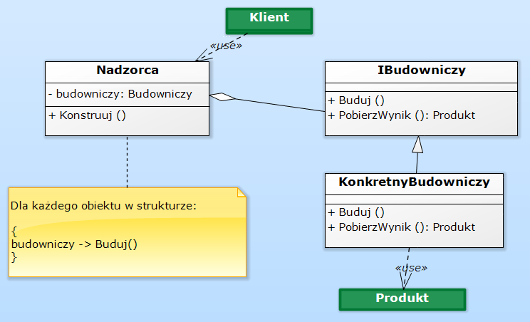
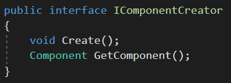
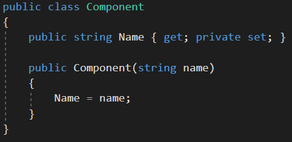
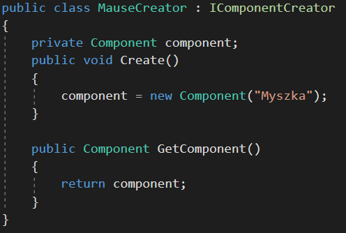
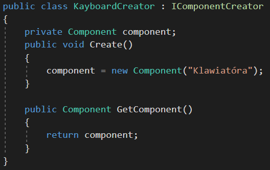
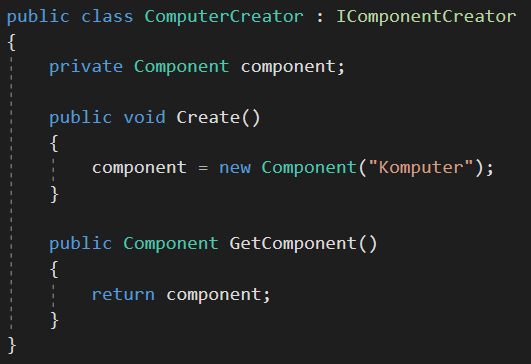
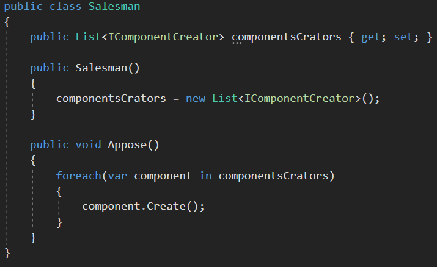
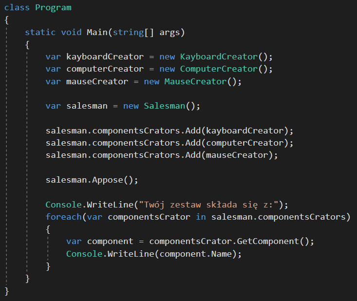
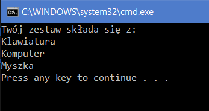

<h4 class="text-success">Budowniczy (Builder)<h4>
 

Diagram wzorca projektowego budowniczy wygląda następująco:

 

&nbsp;Wzorzec projektowy „Budowniczy” jest wzorcem obiektowym i należy do wzorców kreacyjnych. Budowniczy określa związek między konkretnymi sposobami tworzenia obiektów (produktów) a obiektem agregującym te sposoby symbolizującym budowniczego.

 
 
<h4 class="text-success">Przykład<h4>

&nbsp;Na załączonym obrazku przedstawiłem diagram UML wzorca budowniczy, dla tego wzorca stworzyłem przykładową implementację prezentującą jego zastosowanie. Implementację przykładu znajdziesz tutaj:
<a class="base-font-size" href="https://github.com/Rogoda/DesignPattern_Builder.git">
https://github.com/Rogoda/DesignPattern_Builder.git</a> 
 
Zadanie brzmi: stwórz sprzedawcę, który utworzy zestaw komputerowy.
 
Wzorzec budowniczy pasuje do tego przykładu idealnie.
 
 
Pierwsze, od czego zacznę to część abstrakcyjna, zgodnie ze wzorcem ma to być interfejs, bazując na nim, utworzę konkretne kreatory. Dokładnie tak jak na diagramie, tylko naszym przykładzie będą to kreatory komponentów więc interfejs nazwiemy IComponentCreator
 

 
 
Jak widzisz charakterystyczne metody dla poszczególnych kreatorów to Create, która odpowiada za utworzenie Produktu a w naszym przypadku komponentu do zestawu komputerowego oraz GetComponent, który będzie zwracał utworzony już komponent, aby mu to umożliwić, dodam do projektu klasę Component.
 

 
Nazwa na tym etapie w zupełności wystarczy, oczywiście moglibyśmy w łatwy sposób rozszerzyć właściwości tej klasy na przykład o opis i cenę. 
 
 
Teraz kiedy mamy już możliwość utworzenia komponentu i wiemy jak mają wyglądać konkretne kreatory komponentów zajmę się implementacją interfejsu IComponentCreator. Trzy implementacje w zupełności wystarczą jedna dla myszki jedna dla klawiatury i jedna dla samego komputera.
 

 

 

 
 
Świetnie nam idzie, teraz najtrudniejsza część, na diagramie jest to Nadzorca w naszym wypadku nazwiemy go sprzedawcą z angielskiego Salesman, ponieważ chcemy, aby sprzedawca zebrał dla nas zestaw do kupy i nam go pokazał.
Dla sprzedawcy kluczowe jest, aby otrzymał informacje, co chcemy kupić a funkcjonalność, jaką powinien posiadać to możliwość pokazania nam odpowiedniego zestawu.
 

 
Nasz sprzedawca otrzymuje listę kreatorów. Każdy kreator z listy tworzy komponent, takie zachowanie gwarantuje metoda Appose, z języka angielskiego zestaw. Jeżeli w tym momencie nie jest to dla ciebie dostatecznie jasne, zobacz, jak klient wykorzystał sprzedawcę do otrzymania wymarzonego zestawu.
 
 

  
Na początku tworzymy wszystkie obiekty. Drugi krok to dodanie kreatorów do listy dla sprzedawcy. Sprzedawca tworzy zestaw i na samym końcu odbieramy od sprzedawcy wszystkie komponenty.
 
W wyniku tych wszystkich operacji otrzymałeś swój wymarzony zestaw komputerowy :D
 
 

