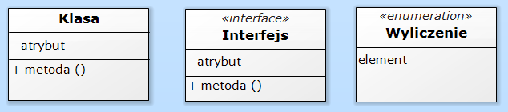
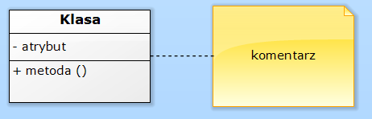
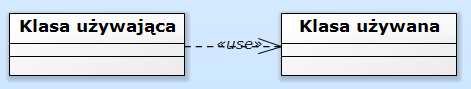
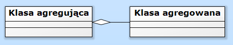
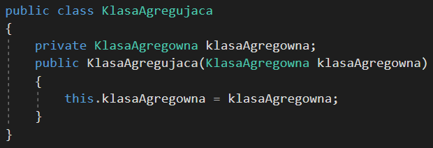
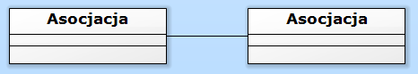
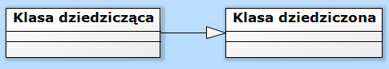
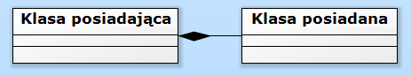
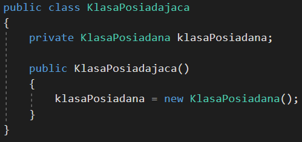
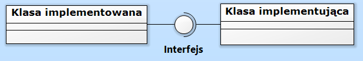

<h4 class="text-success">Unified Modeling Language<h4>
 

&nbsp;UML tłumacząc na język polski to zunifikowany język modelowania i jest to pół formalny sposób modelowania różnego rodzaju systemów. Programiści wykorzystują ten język do przedstawiania struktury oraz procesów zachodzących w oprogramowaniu. Używając UML, jesteś w stanie rozpisać każde rozwiązanie informatyczne, niestety nie jest to język programowania.
 
 
&nbsp;Początkujący programiści nie muszą znać tego języka, ale na kolejnych szczeblach kariery jest on absolutną podstawą. Korzystanie z języka UML ułatwia planowanie oraz tłumaczenie skomplikowanych zagadnień. To nie jest trudny język, jeżeli potrafisz programować, to wszystko załapiesz raz-dwa.    

 
 
<h4 class="text-success">Podstawy<h4>
 

&nbsp;UML jest bardzo rozbudowany, dlatego nie zakopię Cię w szczegółach, tylko z perspektywy programisty przedstawię przydatną wiedzę.

 
 
<h4 class="text-success">Diagram klas<h4>
 

&nbsp;Jednym z wielu możliwości modelowania, na jakie pozwala UML, jest tworzenie diagramu klas, poznasz więc kilka podstawowych symboli oraz szczyptę teorii.
 

 
&nbsp;Powyżej przedstawiłem podstawowe bloki wykorzystywane do budowy modelu. Zarówno w klasach, jak i interfejsach atrybuty są oddzielone od metod, po lewej stronie atrybuty i metody znajduje się znak, plus oznacza publiczne a minus prywatne, z prawej strony po dwukropku możemy podać typ zwracany. Zwróć uwagę na oznaczenia interfejsu oraz enumerable, czyli typu wyliczeniowego mimo to czasem interfejsy są oznaczane za pomocą litery „I” poprzedzającej nazwę właściwą.
 
 

 
&nbsp;Istotną funkcję spełniają również komentarze, zawierają kluczowe wskazówki często niezbędne do zrozumienia przesłania. Zagięty prawy górny róg pozwala szybko odróżnić komentarz od pozostałych bloków.
 
 
&nbsp;W każdym modelu istotną rolę odgrywają połączenia, zwane również relacjami, to dzięki nim jesteśmy w stanie zrozumieć zamysł autora.
 
 

<h4 class="text-success">Zależność<h4>
 

 
&nbsp;Gdy jedna z klas używa drugiej, tworzy się między nimi relacja, którą nazywamy zależnością. Nie powinieneś nadinterpretować tego połączenia, ponieważ oznacza ono tylko użycie, nic więcej.
 
 

<h4 class="text-success">Agregacja<h4>
 

 
&nbsp;Informacja o tym, że klasa agregująca może trzymać instancje klasy agregowanej. Kluczowym słowem jest „może”, ponieważ jeżeli usuniesz wszystkie instancje klasy agregowanej, to klasa agregująca dalej istnieje. Zawsze myśląc o agregacji, mam na myśli słowo „zawiera”.
 
 

 
 

<h4 class="text-success">Asocjacja<h4>
 

 
&nbsp;Zauważyłeś brak strzałki, a bloki nic nie sugerują ?! Jesteś bardzo spostrzegawczy, tę relację wykorzystasz podczas rysowania schematu bazodanowego, po obu stronach umieścimy informację o połączeniu, ale do tego tematu jeszcze wrócę, gdy będziemy omawiać bazy danych.
 
Narysowanie strzałki nie jest błędem, nie jest po prostu wymagana.
 
 

<h4 class="text-success">Generalizacja<h4>
 

 
&nbsp;Trójkąt jest niewypełniony, taka strzałka oznacza dziedziczenie. Nic dodać, nic ująć.
 
 

<h4 class="text-success">Kompozycja<h4>
 

 
&nbsp;Pewien specyficzny rodzaj relacji, połączenie między dwoma obiektami, które kroczą przez życie wspólnie, dopóki śmierć ich nie rozłączy. Niestety jedno nie może istnieć bez drugiego. Ten romans w programowaniu nazywamy kompozycją.
 
 

 
Zwróć uwagę na konstruktor, tworząc obiekt posiadający, powstaje obiekt posiadany, nie może on jednak istnieć dalej po usunięciu obiektu posiadającego.
 

<h4 class="text-success">Implementacja<h4>
 

 
&nbsp;Teraz coś trudniejszego, aby pomóc Ci zrozumieć tę relację przytoczę bardzo życiowy przykład, umowę podpisują dwie osoby, a ich celem mówiąc krótko, jest się dogadać. Ta relacja bardzo przypomina właśnie takie dogadywanie się, umową jest w tym wypadku interfejs.
 
 

<h4 class="text-success">Podsumowanie<h4>
 

&nbsp;Na koniec chciałbym podzielić się z Tobą pewnym przemyśleniem, celem stosowania modelowania jest komunikacja, dlatego nie wahaj się przed dodaniem dodatkowego opisu do bloku lub relacji. Jeżeli fragment modelu nie jest zgodny z konwencją to jeszcze nie koniec świata, najważniejsze jest klarowne przesłanie.
 
 
